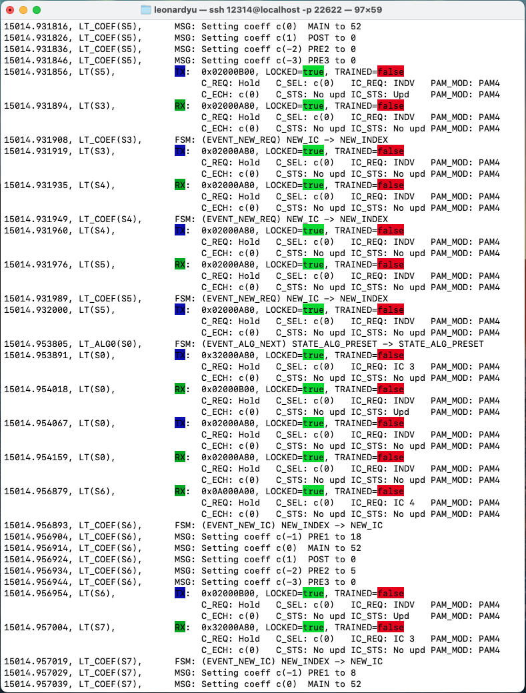

anlt log
========

Description
-----------

Show AN/LT protocol trace log and save to a file.

To **quit** the continuous display mode, press :kbd:`Control-z`.

Synopsis
--------

.. code-block:: text
    
    anlt log
    [-f, --filename <value: text>]
    [-r, --read, <value: text>]
    [-k, --keep <value: text>]
    [-s, --serdes <value>]
    [-p, --polls <value>]
    

Arguments
---------

Options
-------

``-f, --filename`` (text)

Specifies the filename for the log messages to be stored.

``-r, --read -f`` (text)

Specifies the filepath of the log file to display.

``-k, --keep`` (text)
    
Specifies what types of log entries to keep, default to keep all.

Allowed values:

* `all`, to keep all.

* `an`. to keep autoneg only.

* `lt`, to keep lt only.

``-s, --serdes`` (int list)
    
Specifies which serdes of LT logs to keep. If you don't know how many serdes serdes the port has, use :doc:`../an_lt/anlt_log`, default to all serdes.

``-s, --serdes`` (int)
Polls per second, default to 10.

Examples
--------

.. code-block:: text
    
    anlt-utility[123456][port0/2] > anlt log --filename mylog.log --keep lt --serdes 0

