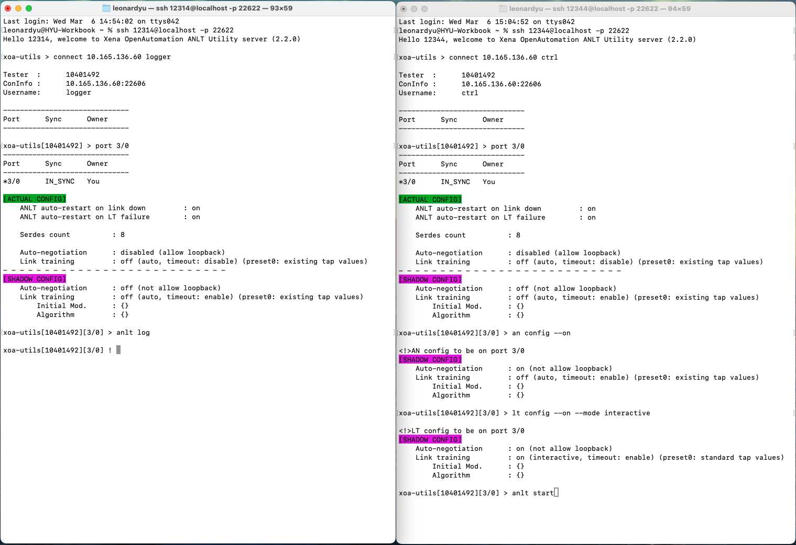
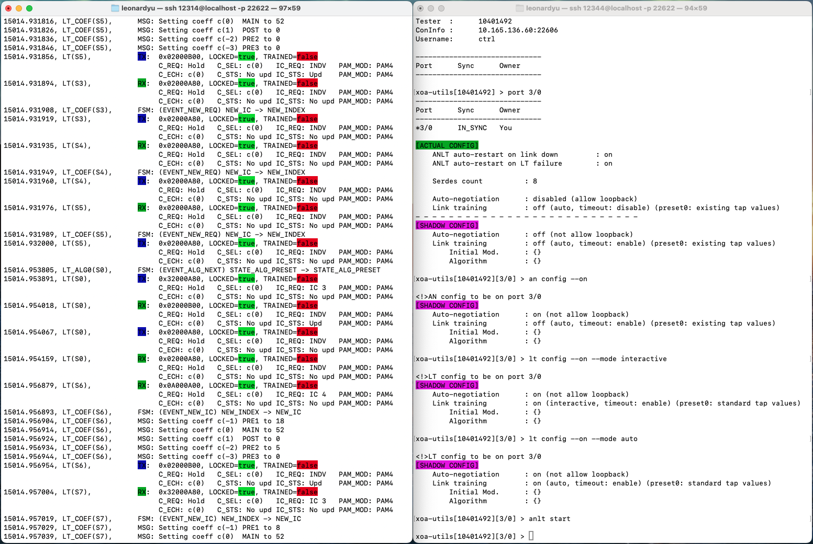

.. role:: xbluethick
.. role:: xgreenthick

Step-by-Step Guide
===================

This section provides a step-by-step guide on how to use AN/LT Utility to do interactive AN/LT test.

.. note::

    ⚡️ You can use **tab key** to auto-complete a command to speed up your input speed.

SSH to AN/LT Utility
-----------------------

After running the AN/LT Utility SSH Server, use another console to SSH to AN/LT Utility.

.. tab:: Windows
    :new-set:

    .. code-block:: doscon
        :caption: SSH to AN/LT Utility.

        > ssh yourname@localhost -p 22622

        Hello yourname, welcome to Xena AN/LT Utility server (2.2.0)

        anlt-utility > 

.. tab:: macOS/Linux

    .. code-block:: console
        :caption: SSH to AN/LT Utility.

        $ ssh yourname@localhost -p 22622

        Hello yourname, welcome to Xena AN/LT Utility server (2.2.0)

        anlt-utility >  

Connect
-------

First, you need to connect to your tester using the command :doc:`../cli_ref/mgmt/connect`.

If you don't know which ports you will use at the time of connecting to the port, just leave the option ``--ports`` empty as the example shows below. You can reserve ports later.

.. code-block:: text

    anlt-utility > connect 10.10.10.10 yourname

Reserve Port
------------

Then, reserve a port on the tester using the command :doc:`../cli_ref/mgmt/port`, as shown in the example below.

.. note::

    You can only work on one port at a time in one console window. If you want to simultaneously work on multiple ports, you can open multiple console windows.

.. code-block:: text

    anlt-utility[123456] > port 0/0

Start AN/LT Logging
-------------------

Start AN/LT logging by :doc:`../cli_ref/anlt/an_lt/anlt_log`.

.. code-block:: text

    anlt-utility[123456][0/0] > anlt log -f mylog.log

.. note::

    This commands **continuously displays** the log messages on the screen so you can keep track of your AN/LT actions.
    
    To **quit** the continuous display mode, press :kbd:`Control-z`.

Use one terminal to view the AN/LT protocol trace, and use another to execute AN/LT commands, as shown in the screenshot below.

Set AN/LT Shadow Configuration
------------------------------

After disabling link recovery on the port, you can start setting AN/LT shadow configuration using :doc:`../cli_ref/anlt/an/an_config`, :doc:`../cli_ref/anlt/lt/lt_config`, :doc:`../cli_ref/anlt/lt/lt_im`, and :doc:`../cli_ref/anlt/lt/lt_alg` as the example shown below.

.. code-block:: text

    anlt-utility[123456][0/0] > an config --off --no-loopback

    anlt-utility[123456][0/0] > lt config --on --preset0 ieee --mode interactive

.. note::

    The initial modulation of each serdes on a port is by default PAM2 (NRZ). If you want to change them, you can use :doc:`../cli_ref/anlt/lt/lt_im`, otherwise do nothing.

.. important::

    :doc:`../cli_ref/anlt/an/an_config`, :doc:`../cli_ref/anlt/lt/lt_config`, and :doc:`../cli_ref/anlt/lt/lt_im` **only change the shadow AN/LT configuration**. **To apply the configuration**, you need to run :doc:`../cli_ref/anlt/an_lt/anlt_start`, otherwise your changes will not take effect on the tester.

Start AN/LT
-----------

After configuring the AN/LT shadow configuration, you should execute :doc:`../cli_ref/anlt/an_lt/anlt_start` to **apply the shadow configuration and let the AN/LT tester to start the AN/LT procedure**.

.. seealso::

    `Auto-Negotiation and Link Training Sequence <https://xenanetworks.com/whitepaper/autoneg-link-training/>`_

.. code-block:: text

    anlt-utility[123456][0/0] > anlt start

Use one terminal to view the AN/LT protocol trace, and use another to execute AN/LT commands, as shown in the sreenshot below.
    

Control LT Interactive
----------------------

If you run LT (interactive), you will need to manually control the LT parameters using the LT Control Commands shown in :doc:`../cli_ref/anlt/lt/index`, for example:

.. code-block:: text

    anlt-utility[123456][0/0] > lt preset 0 2

    anlt-utility[123456][0/0] > lt inc 0 pre3

    anlt-utility[123456][0/0] > lt inc 0 main

    anlt-utility[123456][0/0] > lt dec 0 post

    anlt-utility[123456][0/0] > lt status 0

    anlt-utility[123456][0/0] > lt trained 0

    anlt-utility[123456][0/0] > lt txtapget 0

    anlt-utility[123456][0/0] > lt txtapset 0 0 0 1 56 0

Check AN Status
---------------

Check AN statistics by :doc:`../cli_ref/anlt/an/an_status`.

.. code-block:: text

    anlt-utility[123456][0/0] > an status
    
    [AN STATUS]
        Mode                  : enabled
        Loopback              : allowed

        Duration              : 2,068,747 µs
        Successful runs       : 1
        Timeouts              : 0
        Loss of sync          : 0

        HCD                   : IEEE_800GBASE_CR8_KR8
        HCD negotiation fails : 0
        FEC result            : RS_FEC_KP
        FEC negotiation fails : 0
        
                                    RX    TX
        Link codewords        :      2     1
        Next-page messages    :      0     0
        Unformatted pages     :      0     0

Check LT Status
---------------

Check LT statistics by :doc:`../cli_ref/anlt/lt/lt_status`.

.. code-block:: text

    anlt-utility[123456][0/0] > lt status 0
    
    [LT STATUS]
        Is enabled        : true
        Is trained        : true
        Failure           : no_failure

        Initial mod.      : nrz
        Preset0           : standard tap values
        Total bits        : 2,201,372,480
        Total err. bits   : 24
        BER               : 1.09e-08

        Duration          : 2,000,250 µs

        Lock lost         : 2
        Frame lock        : locked
        Remote frame lock : locked

        Frame errors      : 1
        Overrun errors    : 1

        Last IC received  : Preset 3
        Last IC sent      : Preset 3

        TX Coefficient              :          c(-3)       c(-2)       c(-1)        c(0)        c(1)
            Current level           :              0           0           1          44           0
                                    :         RX  TX      RX  TX      RX  TX      RX  TX      RX  TX
            + req                   :          0   0       0   0       2   2       1   1       0   0
            - req                   :          0   0       0   0       2   2       0   0       0   0
            coeff/eq limit reached  :          0   0       0   0       0   0       0   0       0   0
            eq limit reached        :          0   0       0   0       0   0       0   0       0   0
            coeff not supported     :          0   0       0   0       0   0       0   0       0   0
            coeff at limit          :          0   0       0   0       0   0       0   0       0   0

Stop AN/LT and Restart
----------------------

To stop and start AN/LT again:

.. code-block:: text

    anlt-utility[123456][0/0] > anlt stop

    anlt-utility[123456][0/0] > anlt start
