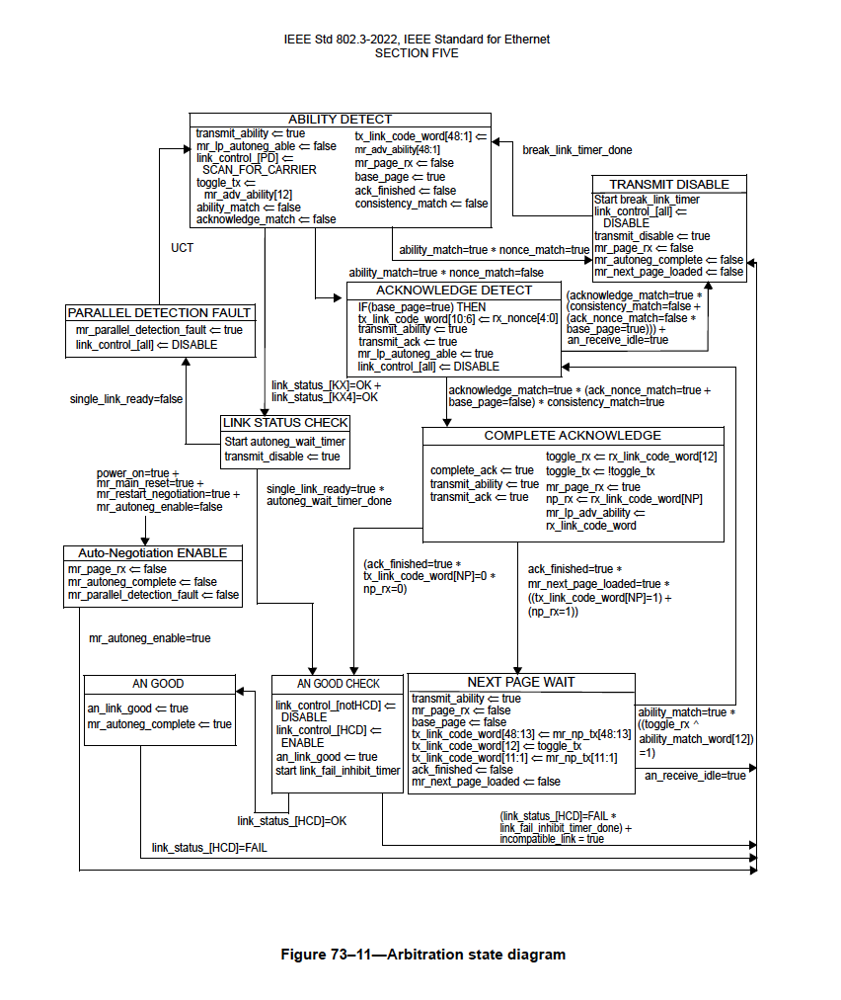

Explanation
========================

ANEG FSM
----------

.. literalinclude:: anlt.txt
    :lines: 10-11

ANEG FSM messages show the FSM state and state transition of ANEG defined in `IEEE 802.3-2022 <https://standards.ieee.org/ieee/802.3/10422/>`_ 73.10.4, as shown in the screenshots below.





ANEG MSG
----------

.. literalinclude:: anlt.txt
    :lines: 46

ANEG MSG messages show log messages from ANEG. Explanations of the message content:

* ``SYNC``: indicates the current lock status. ``SYNC=true`` means locked. ``SYNC=false`` means lock lost.
* ``SYNC LOST``: indicates the previous lock status. ``SYNC LOST=true`` means the port lost lock previously. ``SYNC LOST=false`` means the port locked previously.
* ``NEW_PAGE``: indicates if there is New Page.


ANEG TX & RX
------------

The raw hex value of the transmitted and received ANEG test frames are shown first. Then ``base page`` and ``next page`` indicate if it is Base Page or Next Page, followed by the value of each field.

.. literalinclude:: anlt.txt
    :lines: 25-36
    :emphasize-lines: 2-5, 8-11

.. literalinclude:: anlt.txt
    :lines: 61-74
    :emphasize-lines: 2-7, 9-14

Base Page
^^^^^^^^^^

Base Page is defined in `IEEE 802.3-2022 <https://standards.ieee.org/ieee/802.3/10422/>`_ 73.6


* ``NP``: Next Page, `IEEE 802.3-2022 <https://standards.ieee.org/ieee/802.3/10422/>`_ 73.6.9


* ``ACK``: Acknowledge, `IEEE 802.3-2022 <https://standards.ieee.org/ieee/802.3/10422/>`_ 73.6.8


* ``RF``: Remote Fault, `IEEE 802.3-2022 <https://standards.ieee.org/ieee/802.3/10422/>`_ 73.6.7


* ``TN``: Transmitted Nonce Field, `IEEE 802.3-2022 <https://standards.ieee.org/ieee/802.3/10422/>`_ 73.6.3


* ``EN``: Echoed Nonce, `IEEE 802.3-2022 <https://standards.ieee.org/ieee/802.3/10422/>`_ 73.6.2


* ``C``: Pause Ability, `IEEE 802.3-2022 <https://standards.ieee.org/ieee/802.3/10422/>`_ 73.6.6


* ``FEC``: FEC capability, `IEEE 802.3-2022 <https://standards.ieee.org/ieee/802.3/10422/>`_ 73.6.5


* ``ABILITY``: Technology Ability, `IEEE 802.3-2022 <https://standards.ieee.org/ieee/802.3/10422/>`_ 73.6.4


Next Page
^^^^^^^^^^

Next Page is defined in `IEEE 802.3-2022 <https://standards.ieee.org/ieee/802.3/10422/>`_ 73.7.7. Next Page contains the following fields

* ``ACK``: Acknowledge
* ``ACK2``: Acknowledge 2
* ``MP``: Message Page
* ``T``: Toggle


LT FSM
----------

.. literalinclude:: anlt.txt
    :lines: 12-17

LT FSM messages show the FSM state transition of LT for each serdes lane, e.g. ``LT(S0)`` for lane 0, and ``LT(S1)`` for lane 1.


.. note::

    ``STATE_ALG_INIT``, ``STATE_ALG_PAM4``, ``STATE_ALG_PRESET``, and ``STATE_ALG_DONE`` are internal proprietary link training algorithm states. 

LT MSG
----------

.. literalinclude:: anlt.txt
    :lines: 104

LT MSG messages show log messages from a serdes lane of LT.

LT COEFF MSG
-------------

.. literalinclude:: anlt.txt
    :lines: 108-114
    :emphasize-lines: 2-6

LT COEFF MSG messages show log messages of coefficient change of a serdes lane from LT.

LT TX & RX
----------

.. literalinclude:: anlt.txt
    :lines: 188-203
    :emphasize-lines: 1-3, 5-10, 14-16

The raw hex value of the transmitted and received LT test frames are shown first. Decoding of each field are shown after the raw value.

.. note::

    The example above demonstrates a 4-way handshake of the link training transaction.

    1. The port lane 0 requests the remote to use Preset 1 ``C_REQ: Hold   C_SEL: c(0)   IC_REQ: IC 1   PAM_MOD: PAM4``
    2. The remote confirms the update ``C_ECH: c(0)   C_STS: No upd IC_STS: Upd    PAM_MOD: PAM4`` without requesting any change.
    3. The port tells the remote port to hold ``C_REQ: Hold   C_SEL: c(0)   IC_REQ: INDV   PAM_MOD: PAM4```
    4. The remote port holds the change ``C_ECH: c(0)   C_STS: No upd IC_STS: No upd PAM_MOD: PAM4``


Control Field
^^^^^^^^^^^^^^

The first line ``C_REQ, C_SEL, IC_REQ, PAM_MOD`` is control field information, defined in `IEEE 802.3ck <https://standards.ieee.org/ieee/802.3ck/7322/>`_ Table 162-9.

* ``C_REQ``: Coefficient request
* ``C_SEL``: Coefficient select
* ``IC_REQ``, Initial condition request 
* ``PAM_MOD``, Modulation and precoding request


Status Field
^^^^^^^^^^^^^^

The second line ``C_ECH, C_STS, IC_STS, PAM_MOD`` is status information, defined in `IEEE 802.3ck <https://standards.ieee.org/ieee/802.3ck/7322/>`_ Table 162-10.

* ``C_ECH``: Coefficient select echo
* ``C_STS``: Coefficient status
* ``IC_STS``, Initial condition status
* ``PAM_MOD``, Modulation and precoding status


Full Example
--------------------

A complete log example is shown below.

.. literalinclude:: anlt.txt
    :linenos: