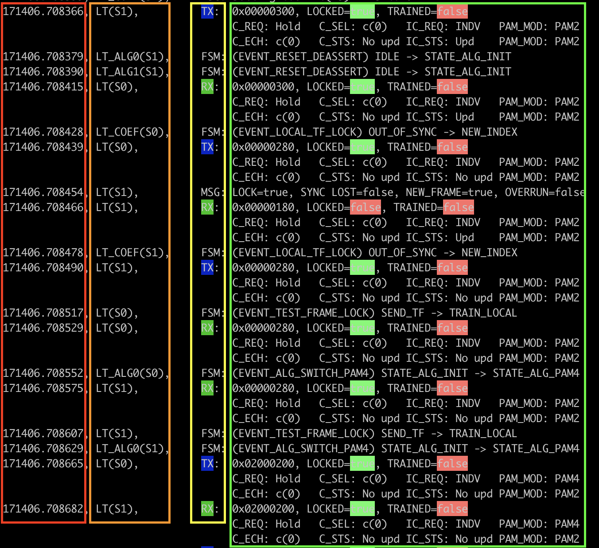

Structure
=====================

A log message consists of 4 parts

1. Timestamp (red block)
2. Protocol (orange block)
3. Message Type (yellow block)
4. Message Content (green block)

Timestamp
---------

The timestamp unit is in seconds, for example, ``171406.514179`` represents 171406.514179 seconds. The granularity is in microseconds.

When analyzing your AN/LT log trace, focus on the relative time difference between messages rather than solely concentrating on the absolute time value. The absolute time value describes the elapsed time since the chassis was started.

Protocol
--------

``ANEG``: message is generated by auto-negotiation.

``LT(S<x>)``: message is generated by link training serdes lane ``<x>``.

``LT_COEFF(S<x>)``: message is generated by link training coefficient on serdes lane ``<x>``.

Message Type
------------

``FSM``: Finite State Machine type.

``MSG``: log message type.

``TX``: AN/LT test frame transmitted by the port to the remote port.

``RX``: AN/LT test frame from the remote port received by the port.

Message Content
----------------

For messages of type ``FSM``, the message content includes the state information or state transition information of the Finite State Machine.

For messages of type ``MSG``, the message content shows the log message.

For messages of type ``TX`` and ``RX``, the message content includes both the raw Hex value of the test frame and its human-readable meaning.
