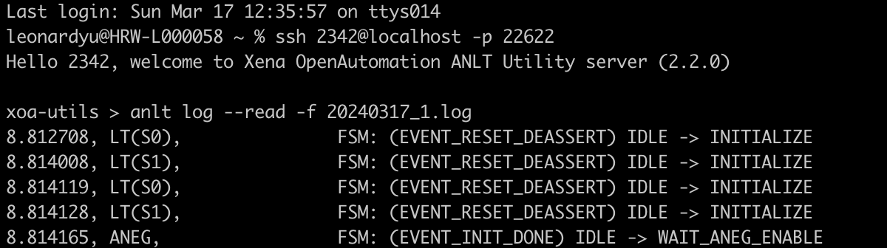

Save or Read Log
================

With Freya, you not only have the capability to manually control the link training process but also gain visibility into the AN/LT protocol by reading the protocol trace log file.

* Use ``anlt log -f <filename>.log`` to display and save the **live log** from Freya port during AN/LT.

.. note::

    You need first execute :doc:`../cli_ref/mgmt/port` to switch your working port before collecting log on it. 

* Use  ``anlt log --read -f  <saved_filename>.log`` to read the **already saved** log file.

You can use AN/LT Utility as a log file reader. Reading a save log file doesn't need to reserve a port or connect to the chassis, as shown in the screenshot below.

.. note::

    You should **place the log file in the same directory** where the AN/LT Utility ``.exe`` is.

